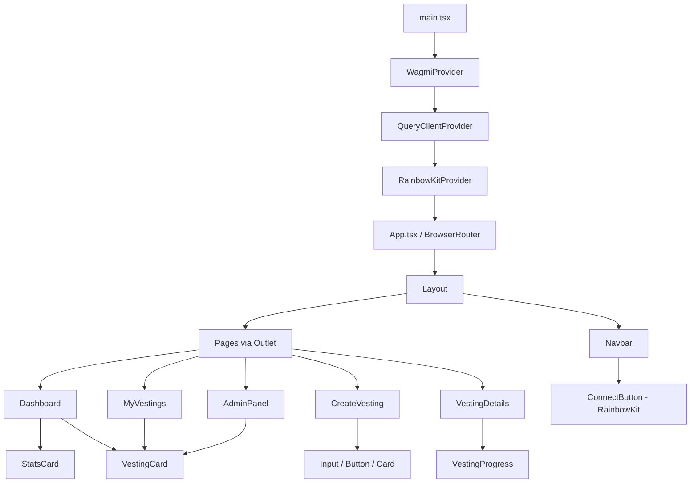
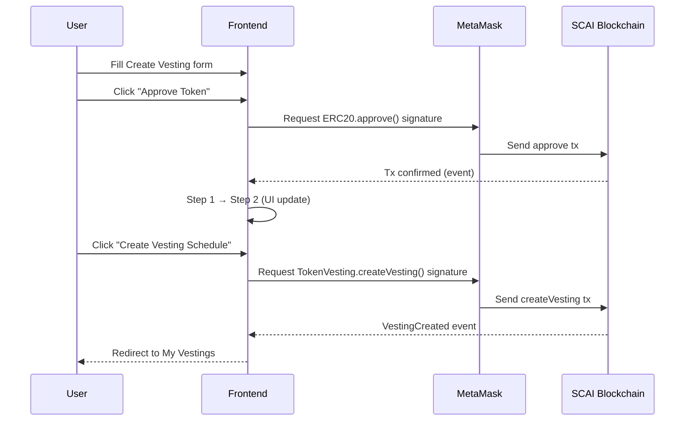
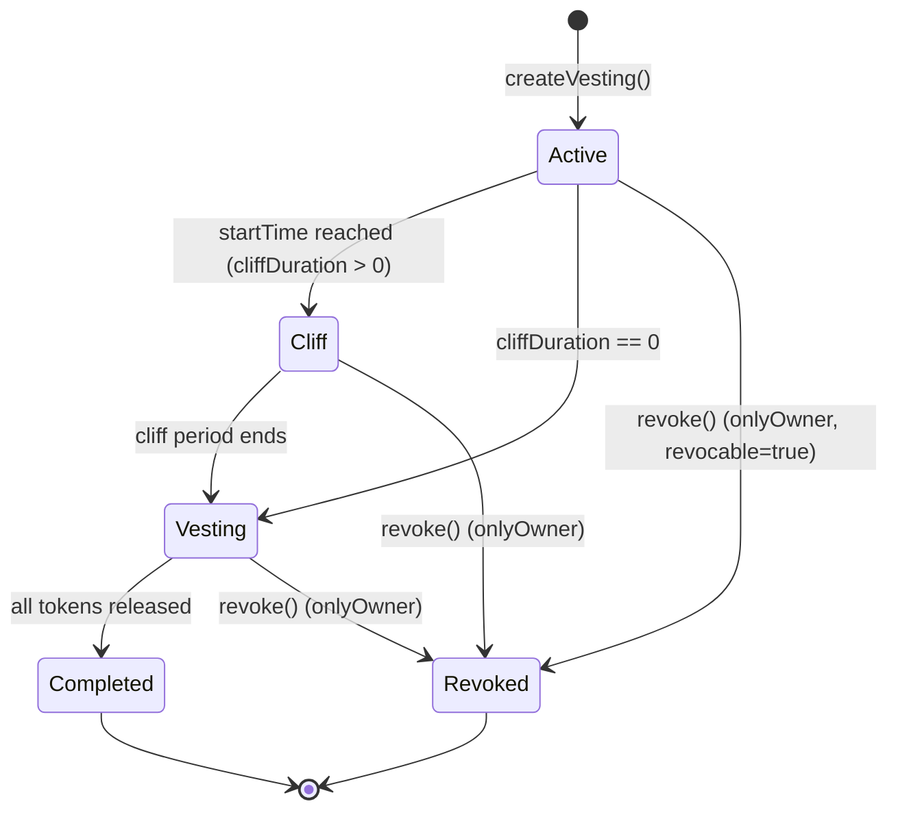

# Architecture – Token Vesting DApp

## System Overview

The Token Vesting DApp is a fully decentralized application (DApp) with **no backend**. All state is stored on the SCAI blockchain. The frontend communicates with the smart contract via JSON-RPC using Wagmi and Viem.

```
┌──────────────────────────────────────────────────────┐
│                     User Browser                      │
│                                                       │
│  ┌─────────────┐     ┌─────────────────────────────┐  │
│  │  React App  │────▶│     MetaMask / WalletConnect │  │
│  │  (Vite)     │     └────────────┬────────────────┘  │
│  └──────┬──────┘                  │                   │
│         │ Wagmi v2 hooks          │ JSON-RPC          │
│         ▼                         ▼                   │
│  ┌─────────────────────────────────────────────────┐  │
│  │              SCAI Mainnet (Chain ID: 34)         │  │
│  │                                                   │  │
│  │           ┌────────────────────────┐             │  │
│  │           │   TokenVesting.sol     │             │  │
│  │           │   (Ownable + SafeERC20)│             │  │
│  │           └────────────────────────┘             │  │
│  └─────────────────────────────────────────────────┘  │
└──────────────────────────────────────────────────────┘
```

---

## Component Architecture



---

## Data Flow



---

## Smart Contract State Machine



---

## Frontend Folder Structure

```
frontend/src/
├── components/
│   ├── layout/
│   │   ├── Navbar.tsx        # Sticky top nav + ConnectButton
│   │   └── Layout.tsx        # Page wrapper with Outlet
│   ├── ui/
│   │   ├── Card.tsx          # Glassmorphism card
│   │   ├── Button.tsx        # Multi-variant button
│   │   ├── Badge.tsx         # Status + generic badges
│   │   ├── Progress.tsx      # Gradient progress bar
│   │   ├── Spinner.tsx       # Loading spinners
│   │   └── Input.tsx         # Form input with label/error
│   └── vesting/
│       ├── VestingCard.tsx   # Schedule summary card
│       ├── VestingProgress.tsx # Detailed timeline view
│       └── StatsCard.tsx     # Dashboard stat widget
├── pages/
│   ├── Dashboard.tsx         # Home with stats + quick actions
│   ├── CreateVesting.tsx     # 2-step approve + create flow
│   ├── MyVestings.tsx        # Beneficiary schedule list
│   ├── VestingDetails.tsx    # Single schedule with release
│   ├── AdminPanel.tsx        # Owner-only management
│   └── NotFound.tsx          # 404 page
├── hooks/
│   ├── useVesting.ts         # All vesting contract hooks
│   ├── useTokenApproval.ts   # ERC-20 approve hooks
│   └── useAdminCheck.ts      # Owner verification
├── utils/
│   ├── format.ts             # Token amounts, address truncation
│   └── time.ts               # Timestamps, durations, status
├── constants/
│   ├── chains.ts             # SCAI chain definition
│   └── addresses.ts          # Contract addresses
├── contracts/
│   └── abi.ts                # TokenVesting + ERC-20 ABIs
├── types/
│   └── vesting.ts            # TypeScript interfaces
├── wagmi.config.ts           # Wagmi + RainbowKit config
├── App.tsx                   # Router + routes
└── main.tsx                  # React entry point
```

---

## Security Considerations

| Concern | Mitigation |
|---|---|
| Reentrancy | OpenZeppelin `SafeERC20` + checks-effects-interactions |
| Access control | `onlyOwner` on `revoke()` |
| Integer overflow | Solidity 0.8.x built-in overflow checks |
| Zero address | Custom errors for invalid inputs |
| Private key exposure | `.env` excluded from `.gitignore` |
| Front-running | No MEV-sensitive operations |
